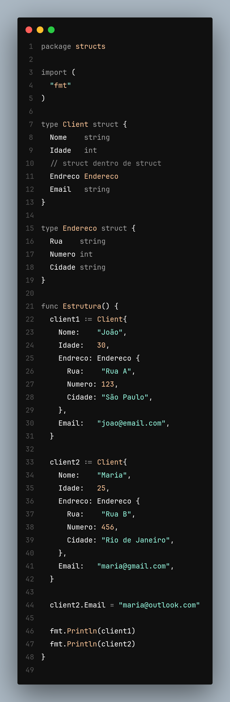

# Curso de Go

Go é uma linguagem criada para resolver problemas de concorrência.

### Comandos

- Inicializar um módulo go: go mod init nome do modulo
- Rodar main: go run main.go
- Bundle do pacote: go bundle -o nome do bundle

---

Inicializar o módulo Go com uma tag github e nome do projeto é um padrão de comunidade (também serve para identificar o módulo).
É recomendando criar um Go módulo (go.mod) com github nome do usuário e depois nome do projeto.

## Os pacotes (packages) servem como namespace para utilizar funções em outros lugares (funções, métodos, variáveis)

Em Go, tudo que começa com a letra maiúscula é exportável (e é possível acessar fora do seu pacote).
Se a letra for minúscula, ela não é exportável é apenas visível ao seu módulo.

## Variáveis e constantes

Em Go existem duas maneiras de criar variáveis, e essas duas maneiras têm variações.
A primeira forma é colocar a palavra reservada "var" o nome da variável e depois o tipo e a sua expressão:

```go
var info string
var texto string = "ola"
var idade int = 0
```

Quando o tipo não é passado, ela sumi o tipo do valor da variável:

```go
var texto = "Yaba"
var idade = 25
```

Go tem um mecanismo de inicialização de variável quando ás variáveis não são inicializadas logo no inicio.

```go
var info string // info vai receber string vazia ""
var idade int // idade vai receber 0
var casado bool // casado vai receber false
```

Declaração de variável curta/short:

```go
info := "alguma coisa informativa"
idade := 25
casado := false
```

### Constantes

Valores não modificados após a declaração

```go
package main

import "fmt"

const nome string = "Yaba"

func main() {
  fmt.Println(nome)
}
```

---

### Tipos básicos

O tamanho de um tipo de dado vai depender da arquitetura do sistema,
ele pode ocupar 32 ou 64 bits, mas também pode ser forçado um tipo de número inteiro ocupar menos espaço na memória

- Quando não é informado o tamanho de bits do tipo, ele assume o da memória do sistema, que por padrão é 64 bits
- Para saber a margem de números que cada bit armazena, basta consultar a doc

Faz-se adaptação de bits por questão de performance do sistema, para que ás variáveis ocupem menos espaços

#### int

```go
package main

import "fmt"

// int8: Inteiro de 8 bits (valores de -128 a 127)
// int16: Inteiro de 16 bits (valores de -32768 a 32767)
// int32: Inteiro de 32 bits (valores de -2147483648 a 2147483647)
// int64: Inteiro de 64 bits (valores de -9223372036854775808 a 9223372036854775807)

func main() {
  var idade int = 30 // 64 bits por padrão
  var contador int32 = 2 // 32 bits
  var indice int8 = 1 // 8 bits

  fmt.Println("Idade: ", idade)
}
```

#### float

- float8, float16, float32 e float64 eles são diferentes para realizar operações. Para realizar operações matemáticas, eles precisam ter a mesma quantidade de bits, caso contrário irá dar erro, exemplo abaixo:

```go
package main

import "fmt"

func main() {
  var numeroOne float64 = 10.5
  var numeroTwo float64 = 10.5
  var operacao = numeroOne / numeroTwo

  fmt.Println("Resultado: ", operacao)
}
```

#### bool

- O tipo bool (booleanos) é usado para representar valores lógicos, ajudam a controlar fluxos no código. O valor inicial é false.

```go
package main

import "fmt"

func main() {
  var maior bool = 10 > 5
  var menor bool = 10 < 5

  fmt.Println("10 é maior que 5?: ", maior)
  fmt.Println("10 é menor que 5?: ", menor)
}
```

#### string

- strings (textos), existem um pacote chamado strings, que permite realizar varias operações em textos

Concatenar: juntar um texto com outro.

```go
package main

import "fmt"

func main() {
  var hello string = "ola, mundo"
  var question string = "Como vai?"

  // concatenação
  var meet = hello + question
  fmt.Println(meet)
  // tornar o texto em maiúsculas
  fmt.Println(strings.ToUpper(meet))
  // buscar uma palavra, retorna true/false
  fmt.Println(strings.Contains(meet, "mundo"))
}
```

---

### Tipos compostos

#### Array

É uma estrutura de dados que têm um tamanho fixo (é imutável),
e funciona como uma lista para armazenar itens do mesmo tipo, onde os itens são indexados.
Ás operações mais comum são ás de inserções, leitura, remoção e divisão de dados.

- No Array é necessário mapear um índice para atribuir valor.

```go
package main

import "fmt"

func main() {
	var gavetas [2]string;
  gavetas[0] = "Copos"
  gavetas[1] = "Panos"

  fmt.Println(gavetas[0], gavetas[1])
}
```

#### Slices

Slices têm tamanhos flexíveis, são espaços armazenados na memória para armazenar itens do mesmo tipo,
mas diferente de _Array_ o tamanho pode aumentar ou diminuir conforme a necessidade.
No Slice ás operações também são de inserções, leitura, remoção e divisão de dados.

- No Slice não é necessário mapear um índice para atribuir valor. Existe uma função que se encarrega de adicionar valores e aumentar a capacidade do Slice, e pode-se adicionar mais de um valor desde que seja do mesmo tipo de dado.

- Para se acessar os valores do Slice, acessa-se pelos índice. O mais indicado é verificar primeiro o tamanho do Slice antes de ser acessado.

- Para se dividir um Slice, é necessário mapear o índice inicial e o índice final, e eles são separados por dois pontos ":", por padrão o último índice é subtraído por 1 "[x:x-1]", no último índice é sempre o tamanho-1.

- Na divisão de Slice, quando o primeiro índice não é passado considera-se que o índice é "0" [:2]. E se no último índice não for passado, ele considera o tamanho total do Slice -1, que dá o último índice do Slice "[0:]".

```go
package main

import "fmt"

func main() {
	var gavetas []string;
  // append é a função responsável por adicionar valores
  gavetas[] = append(gavetas, "copos", "panos", "pratos")

  fmt.Println(gavetas)
  // ver tamanho da estrutura Slice
  fmt.Println(len(gavetas))
  fmt.Println(gavetas[0], gavetas[1])
  // dividir um Slice, do índice 1 até o 2 [x:x-1]
  fmt.Println(gavetas[1:2])
  // primeiro índice é 0
  fmt.Println(gavetas[:2])
  // ultimo índice
  fmt.Println(gavetas[2:])
  // pegar apenas até o índice 2
  gavetas = gavetas[:2]
  fmt.Println(gavetas)
}
```

#### Map

- São estruturas chave valor, no qual a chave tem um tipo e o valor também. Eles ajudam por ser uma estrutura de acesso e inserção rápida, dado que a chave sempre tem que ser única.

- Caso o valor no map não existir, será retornado 0.

```go
package main

import "fmt"

func main() {
	var pessoas = map[string]int{}
  pessoas["yaba"] = 25
  pessoas["ernesto"] = 25

  fmt.Println(pessoas["yaba"]) // output: 25

  if idade, ok := pessoas["yaba"]; ok {
    fmt.Println("Pessoa existe no map", idade, ok)
  } else {
    fmt.Println("Pessoa não existe no map")
  }

  // deletando um map
  delete(pessoas, "yaba")
  fmt.Println(pessoas) // output: ernesto
}
```

### Fluxos de controles

#### if e else

- if e else, expressões para avaliar se uma determinada condição é verdadeira ou false, e dependendo do resultado da condição, é feito uma operação.

```go
package main

import "fmt"

func main() {
	nota := 75

	if nota >= 90 {
		fmt.Println("Aprovado, aluno destacado!")
	} else if nota >= 70 {
		fmt.Println("Aprovado, aluno destacado!")
	} else {
		fmt.Println("Reprovado!")
	}
}
```

- Declaração de uma variável em uma expressão de um if (forma curta de atribuição de valor). É muito usado quando se está a verificar se algo existe ou se o erro é diferente de New, e a variável declarada na expressão de verificação, só fica disponível no escopo local da condição.

```go
package main

import (
	"errors"
	"fmt"
)

func main() {
	// declaração curta. Atribuição de valor (função thisIsAnError) e verificar se ele é diferente de nil
	if err := thisIsAnError(); err != nil {
		fmt.Println(err.Error())
	}
}

// função que retorna um erro
func thisIsAnError() error {
	// criar um error handler
	return errors.New("Isto é um erro!")
}
```

- Por padrão o map quando se tenta acessar uma chave, ele retorna ou o valor ou o segundo item que diz se ele existe ou não (verdadeiro ou não).

```go
package main

import (
	"fmt"
)

func main() {
	players := map[string]int{
		"yaba": 25,
	}

	// verificar se um jogador existe, caso sim, print quantos pontos tem.
	// value (valor do map) e ok (se ele existe ou não) são os retornos do acesso de uma chave em um map
	if value, ok := players["yaba"]; ok {
		fmt.Println("pontos:", value, ok)
	}
}
```

#### switch case

- É uma forma de lidar com condicionais de uma forma mais legível, para evitar vários if else aninhados

Verificar quando é sábado:

```go
package main

import (
	"fmt"
	"time"
)

func main() {
	fmt.Println("Quando é sábdo?")
	today := time.Now().Weekday()

	switch time.Saturday {
	case today + 0:
		fmt.Println("é hoje")
	case today + 1:
		fmt.Println("é amnhã")
	case today + 2:
		fmt.Println("é em dois dias")
	default:
		fmt.Println("Tá longe ainda...")
	}
}
```

#### for

- É uma maneira de fazer um loop em uma determinada estrutura de dados ou pra criar uma regra (instrução) no código/programa. Ás suas características é que o primeiro elemento é uma inicialização, o segundo é uma expressão que enquanto for verdadeira o loop vai continuar, o terceiro é a iteração (é o processo de repetir um bloco de código ou um conjunto de instruções).

```go
package main

import (
	"fmt"
)

func main() {
	sum := 0
  // for
	for i := 0; i < 10; i++ {
		fmt.Println(i)
		sum += i
	}

	fmt.Println("Soma:", sum)
}
```

- Em Go, o for também tem o comportamento de while

```go
package main

import (
	"fmt"
)

func main() {
	sum := 2
	// for com comportamento de loop while
	for sum < 20 {
		sum += 2
		fmt.Println(sum)
	}

	fmt.Println("Soma:", sum)
}
```

- For sobre Slices

```go
package main

import (
	"fmt"
)

func main() {
	nums := []int{1, 2, 3, 4, 5}

	for i := 0; i < len(nums); i++ {
		// acessar valor do Slice, o i é o responsável por acessar os índices
		fmt.Println(nums[i])
	}
}
```

- For infinito. Existem programas que rodam de forma infinita, são chamados de **_long-running programs_** (processos de longa duração) ou **_daemons_** (em servidores Linux) e "serviços" (no Windows). Eles são projetados para nunca terminar a menos que sejam interrompidos manualmente ou por falhas, aguardando continuamente por eventos, requisições ou agendamentos.

- Exemplos comuns incluem servidores web, bancos de dados, bots de chat, coletores de dados (crawlers) e sistemas de automação.

```go
package main

import (
	"fmt"
)

func main() {
	// sem nenhuma expressão para servir como condicional, cria-se um loop infinito
	for {
		fmt.Println("long-running programs")
	}

  for true {
    // código
  }
}
```

#### range

- É uma estrutura de loop. Facilita a criação de loops, especialmente com estruturas de dados como slices e maps. Com range, conseguimos acessar chaves e valores sem a necessidade de manipular índices manualmente. range dá a possibilidade de acessar elementos em um slice ou iterar sobre um map.

- O range retorna a chave e valor da estrutura que se está a iterar.

```go
package main

import (
	"fmt"
)

func main() {
	nums := []int{5, 4, 3, 2, 1}
	for key, value := range nums {
		fmt.Println(key, value)
	}
}
```

- Slice de string

```go
package main

import (
	"fmt"
)

func main() {
	nums := []string{"yaba", "samuel", "manuel", "ernesto"}
	for key, value := range nums {
		fmt.Println(key, value)
	}
}
```

- Iterando map com range

```go
package main

import (
	"fmt"
)

func main() {
	users := map[string]string{
		"nome":  "yaba",
		"idade": "25",
	}

	for key, value := range users {
		fmt.Println(key, value)
	}
}
```

- Se for necessário apenas um valor entre key ou value no range, basta colocar um underline (é forma de ocultar do compilador para não colocar ele na memória, dizer que não será usado):

```go
package main

import (
	"fmt"
)

func main() {
	users := map[string]string{
		"nome":  "yaba",
		"idade": "25",
	}

  // pegar apenas o value
	for _, value := range users {
		fmt.Println(value)
	}
}
```

```go
package main

import (
	"fmt"
)

func main() {
	users := map[string]string{
		"nome":  "yaba",
		"idade": "25",
	}

  // pegar apenas a key
	for key, _ := range users {
		fmt.Println(key)
	}
}
```

### Structs

- É a maneira com que criamos e compomos tipos no Go, cria-se estruturas através de struct. Ela funciona como se fosse uma classe.Structs são usados para criar um agrupamento de dados de informações que serão usadas para trafegar no código.

**_Arquivo main.go_**

```go
package main

import (
	"github.com/yabaernesto/curso-go/structs"
)

func main() {
	structs.Estrutura()
}
```

**_Arquivo struct.go_**

```go
package structs

import (
	"fmt"
)

type Client struct {
	Nome    string
	Idade   int
	Endreco string
	Email   string
}

// funcao publica
func Estrutura() {
	client1 := Client{
		Nome:    "João",
		Idade:   30,
		Endreco: "Rua A, 123",
		Email:   "joao@email.com",
	}

	client2 := Client{
		Nome:    "Maria",
		Idade:   25,
		Endreco: "Rua B, 456",
		Email:   "maria@gmail.com",
	}

  client2.Email = "maria@outlook.com"

	fmt.Println(client1)
	fmt.Println(client2)
}
```

- É possível usar structs dentro de structs
  

### Funções/func

```go
package main

import "fmt"

func main() {
	response := Soma(10, 15)

	fmt.Println("Soma: ", response)

  multiplica := func (x int) int {
    return x * 2
  }

  resultado := multiplica(2)
  fmt.Println("Multiplicação", resultado)
}

func Soma(a, b int) int {
	return a + b
}
```

### Métodos

- Métodos estão extremamente relacionados a structs. Em Go, métodos são funções amarradas a structs

```go
package main

import "fmt"

type Pessoa struct {
	Nome string
	Idade int
}

// metodo. Pessoa recebe o metodo Apresentar, o "p" pode ser qualquer coisa
func (p Pessoa) Apresentar() {
	fmt.Printf("Olá, meu nome é %s e tenho %d anos.", p.Nome, p.Idade)
}

func main() {
	// metodo
	p1 := methods.Pessoa{Nome: "Yaba", Idade: 25}
  p2 := methods.Pessoa{Nome: "Ernesto", Idade: 25}
	p1.Apresentar()
  p2.Apresentar()
}
```

- Método faz cópia

```Go
package main

import "fmt"

type Pessoa struct {
	Nome string
	Idade int
}

// metodo. Pessoa recebe o metodo Apresentar, o "p" pode ser qualquer coisa
func (p Pessoa) Apresentar() {
  // p é uma cópia, para receber o valor original precisa ter ponteiro. O método está a modificar o valor por cópia
  p.Nome = "Samuel"
	fmt.Printf("Olá, meu nome é %s e tenho %d anos.\n", p.Nome, p.Idade)
}

func main() {
	// metodo
	p1 := methods.Pessoa{Nome: "Yaba", Idade: 25}
  // output nome: Samuel
  p1.Apresentar()
  // output: Yaba
  fmt.Println(p1.Nome)
}
```

- Método com Ponteiro (passar por referência)

```Go
package main

import "fmt"

type Pessoa struct {
	Nome string
	Idade int
}

// método. Pessoa recebe o metodo Apresentar, o "p" pode ser qualquer coisa. O método está a modificar o valor por referência
func (p *Pessoa) Apresentar() {
  // p é uma cópia, para receber o valor original precisa ter ponteiro
  p.Nome = "Samuel"
	fmt.Printf("Olá, meu nome é %s e tenho %d anos.\n", p.Nome, p.Idade)
}

func main() {
	// metodo. O ponteiro irá modificar o valor original, logo Nome não será Yaba mas sim Samuel
	p1 := methods.Pessoa{Nome: "Yaba", Idade: 25}
  // output nome: Samuel
  p1.Apresentar()
  // output: Yaba
  fmt.Println(p1.Nome)
}
```

## Ponteiros / Pointers

- Um ponteiro é uma variável que armazena um endereço de memória.
- Um ponteiro é uma variável cujo valor é um endereço de memória.

Um ponteiro também ocupa espaço na memória. Ele é uma variável como qualquer outra, mas em vez de guardar um número (10) ou uma string ("Olá"), ele guarda um endereço.

- &x → endereço onde x está armazenada
- `var y *int = &x ` → cria um ponteiro que guarda o endereço de x
- `*y ` → acessa o valor que está naquele endereço


- A partir do ponteiro é possível alterar o valor da variável por referência

```go
package main

type Pessoa struct {
	Nome string
}

func main() {
	// ponteiros
	var p1 Pessoa = Pessoa{ Nome: "Yaba" }
	var p2 Pessoa = Pessoa{ Nome: "Ernesto" }

	var p3 *Pessoa = &p1
	// valor de p1 será alterado por referência (&)
	p3.Nome = "Manuel"

	fmt.Println(&p1.Nome)
	fmt.Println(&p3.Nome)
}
```
